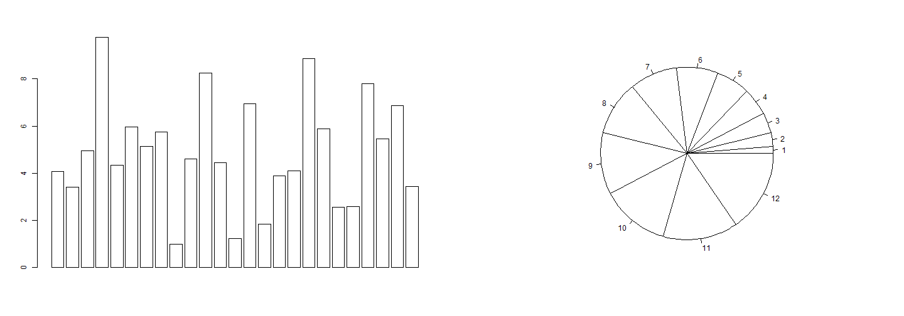
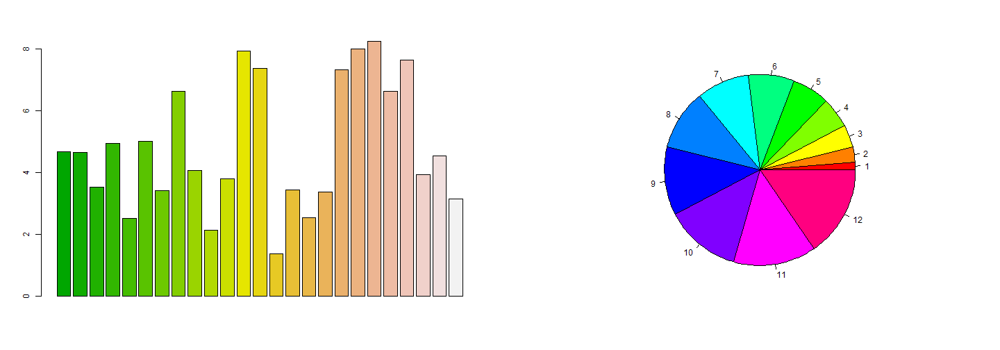

Exploring Color
========================================================
author: Michael O'Flaherty  
date: Sat Sep 20 10:27:30 2014  
An Introduction to Color Explorer  

Why Use Color?
========================================================

Have you ever read a report lacking color where the presentation left you feeling sorta "blue"? (No pun intended.)


```r
dataset <- rnorm(25, mean=5, sd=2)
par(mfrow=c(1,2))
barplot(dataset, col=FALSE)
pie(seq(1:12), col=FALSE)
```

 

Color Adds "Pop"
========================================================
Adding color to charts is an easy way to leave your audience mesmerized!

```r
dataset <- rnorm(25, mean=5, sd=2)
par(mfrow=c(1,2))
barplot(dataset, col=terrain.colors(25))
pie(seq(1:12), col=rainbow(12))
```

 

Why Color Explorer?
========================================================
Color Explorer allows you to visualize different color schemes. You can set:
* The type of chart
* The number of elements displayed
* The color scheme

Order Now!
========================================================
A free trial of Color Explorer is available at:  
http://moflaherty.shinyapps.io/ColorExplorer  

The first 300 people to order receive the low introductory price of $49.95. Payment can be sent directly to michael@oflaherty.com.
